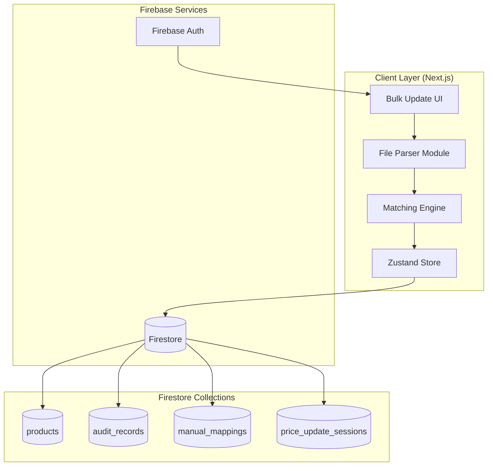
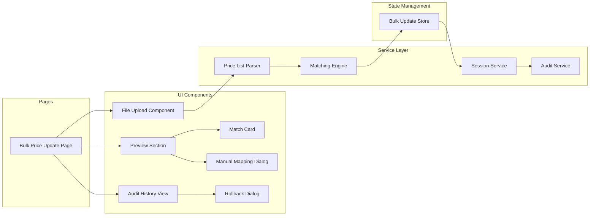
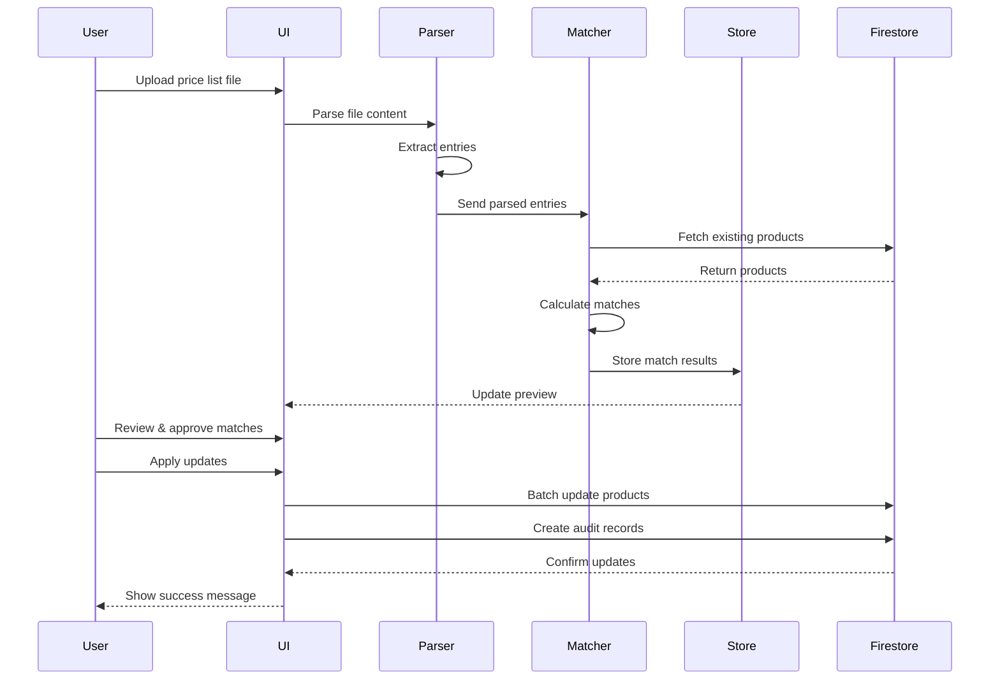
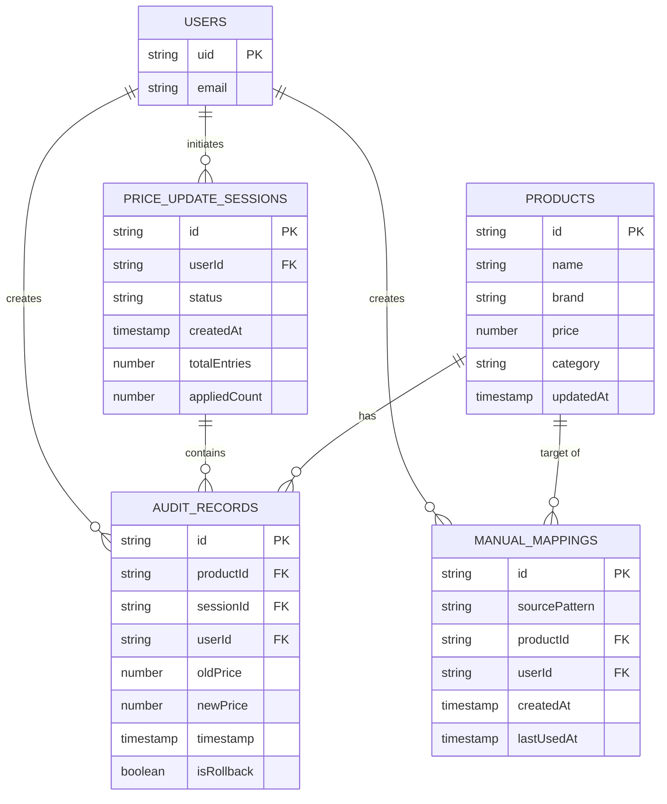
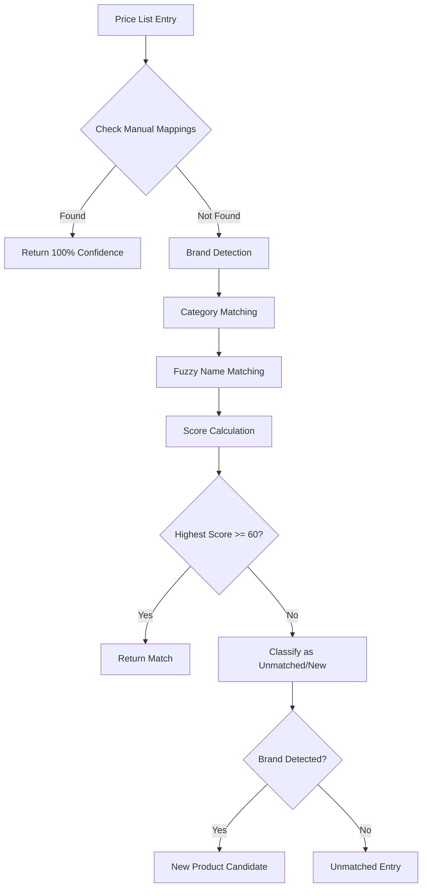
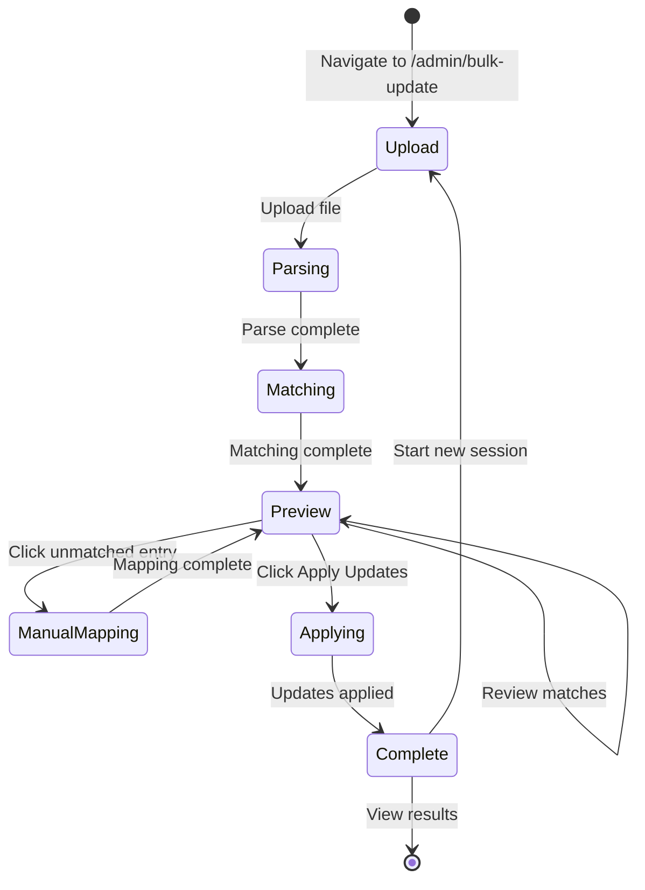

# Design Document: Bulk Price Update System

## Overview

The Bulk Price Update System provides a comprehensive solution for automated price updates in an e-commerce product catalog. The system addresses the current manual process limitations by providing intelligent product matching, preview capabilities, audit trails, and bulk product creation.

### Problem Statement

The current price update process requires:
- Manual script creation for each price update
- 82% match rate leaving 40 products unmatched
- No preview or validation before applying changes
- No audit trail or rollback capability
- No persistence of manual mappings for future updates

### Solution Summary

A web-based bulk price update interface integrated into the existing admin panel that:
- Parses price lists in multiple formats (text, CSV, Excel)
- Intelligently matches products using fuzzy search with confidence scoring
- Provides a 3-section preview interface (existing products, new products, unmatched)
- Creates new products in bulk
- Maintains complete audit trails
- Enables rollback operations
- Persists manual mappings for future sessions

### Key Design Decisions

| Decision | Rationale |
|----------|-----------|
| Client-side parsing | Reduces server load, provides immediate feedback, works offline |
| Fuzzy matching with fuse.js | Industry-standard library, handles typos and variations well |
| Three-tier confidence scoring | Balances automation with manual oversight |
| Firestore batch operations | Atomic updates, handles 500 operations per batch |
| Session-based audit trail | Enables rollback at session level |

---

## Architecture

### High-Level Architecture



### Component Architecture



### Data Flow



---

## Components and Interfaces

### UI Components

#### 1. BulkPriceUpdatePage

Main page component orchestrating the entire bulk update workflow.

```typescript
interface BulkPriceUpdatePageProps {
  // No props - uses global store
}

// Internal state managed by Zustand store
interface BulkUpdateState {
  step: 'upload' | 'matching' | 'preview' | 'applying' | 'complete';
  parsedEntries: ParsedEntry[];
  matchResults: MatchResult[];
  newProductCandidates: NewProductCandidate[];
  unmatchedEntries: UnmatchedEntry[];
  selectedSession: PriceUpdateSession | null;
  isProcessing: boolean;
  progress: number;
}
```

#### 2. FileUploadComponent

Handles file input and format detection.

```typescript
interface FileUploadComponentProps {
  onFileParsed: (entries: ParsedEntry[], errors: ParseError[]) => void;
  acceptedFormats: ('.txt' | '.csv' | '.xlsx' | '.xls')[];
  maxFileSize: number; // in bytes, default 10MB
}

interface ParsedEntry {
  id: string;
  rawText: string;
  productName: string;
  category: string | null;
  price: number;
  lineNumber: number;
}

interface ParseError {
  lineNumber: number;
  rawText: string;
  error: string;
}
```

#### 3. PreviewSection

Three-section preview interface for match results.

```typescript
interface PreviewSectionProps {
  existingProductMatches: MatchResult[];
  newProductCandidates: NewProductCandidate[];
  unmatchedEntries: UnmatchedEntry[];
  onApproveMatch: (matchId: string) => void;
  onRejectMatch: (matchId: string) => void;
  onApproveAll: (section: 'existing' | 'new') => void;
  onManualMap: (unmatchedId: string, productId: string) => void;
}

interface MatchResult {
  id: string;
  parsedEntry: ParsedEntry;
  matchedProduct: AdminProduct;
  confidenceScore: number;
  confidenceLevel: 'high' | 'medium';
  status: 'pending' | 'approved' | 'rejected';
  isManualMapping: boolean;
}

interface NewProductCandidate {
  id: string;
  parsedEntry: ParsedEntry;
  detectedBrand: string | null;
  status: 'pending' | 'approved' | 'rejected';
}

interface UnmatchedEntry {
  id: string;
  parsedEntry: ParsedEntry;
  suggestedProducts: AdminProduct[]; // Top 5 suggestions
}
```

#### 4. MatchCard

Individual card showing match details.

```typescript
interface MatchCardProps {
  match: MatchResult;
  onApprove: () => void;
  onReject: () => void;
  showActions: boolean;
}

// Displays:
// - Product name (from catalog)
// - Price list entry name
// - Current price → New price
// - Price difference (with color coding)
// - Confidence score badge
// - Approve/Reject buttons
```

#### 5. ManualMappingDialog

Modal for manually mapping unmatched entries.

```typescript
interface ManualMappingDialogProps {
  unmatchedEntry: UnmatchedEntry;
  products: AdminProduct[];
  onMap: (productId: string) => void;
  onCancel: () => void;
  searchPlaceholder: string;
}

// Features:
// - Search input with autocomplete
// - Product list with name, brand, category
// - Recent mappings suggestions
```

#### 6. AuditHistoryView

Displays historical price changes.

```typescript
interface AuditHistoryViewProps {
  auditRecords: AuditRecord[];
  onLoadMore: () => void;
  onFilterChange: (filters: AuditFilters) => void;
  isLoading: boolean;
}

interface AuditFilters {
  dateRange: { start: Date; end: Date } | null;
  productId: string | null;
  userId: string | null;
}

interface AuditRecord {
  id: string;
  productId: string;
  productName: string;
  oldPrice: number;
  newPrice: number;
  timestamp: Date;
  userId: string;
  userName: string;
  sessionId: string;
  isRollback: boolean;
}
```

#### 7. RollbackDialog

Confirmation dialog for rollback operations.

```typescript
interface RollbackDialogProps {
  session: PriceUpdateSession;
  onConfirm: (selectedProductIds: string[]) => void;
  onCancel: () => void;
}

// Shows:
// - List of all changes in session
// - Checkboxes to select which to rollback
// - Warning about creating new audit records
```

### Service Layer

#### 1. PriceListParserService

```typescript
class PriceListParserService {
  // Parse plain text format: "PRODUCT NAME [CATEGORY]: ₹PRICE"
  parseTextFormat(content: string): ParseResult;
  
  // Parse CSV format with configurable columns
  parseCSVFormat(content: string, options?: CSVParseOptions): ParseResult;
  
  // Parse Excel format
  parseExcelFormat(buffer: ArrayBuffer): ParseResult;
  
  // Auto-detect format and parse
  parse(file: File): Promise<ParseResult>;
  
  // Validate parsed entry
  validateEntry(entry: ParsedEntry): ValidationResult;
}

interface ParseResult {
  entries: ParsedEntry[];
  errors: ParseError[];
  totalLines: number;
  parseTime: number;
}

interface CSVParseOptions {
  productNameColumn: string | number;
  priceColumn: string | number;
  categoryColumn?: string | number;
  hasHeader: boolean;
  delimiter: string;
}
```

#### 2. MatchingEngineService

```typescript
class MatchingEngineService {
  private fuse: Fuse<AdminProduct>;
  private products: AdminProduct[];
  private manualMappings: ManualMapping[];
  
  // Initialize with product catalog
  initialize(products: AdminProduct[], mappings: ManualMapping[]): void;
  
  // Match single entry
  matchEntry(entry: ParsedEntry): MatchResult | UnmatchedEntry | NewProductCandidate;
  
  // Match all entries
  matchAll(entries: ParsedEntry[]): MatchingResult;
  
  // Calculate confidence score
  calculateConfidence(entry: ParsedEntry, product: AdminProduct): number;
  
  // Check for existing manual mapping
  checkManualMapping(entry: ParsedEntry): AdminProduct | null;
  
  // Detect brand from product name
  detectBrand(productName: string): string | null;
}

interface MatchingResult {
  matches: MatchResult[];
  newProducts: NewProductCandidate[];
  unmatched: UnmatchedEntry[];
  matchRate: number;
  processingTime: number;
}
```

#### 3. AuditService

```typescript
class AuditService {
  // Create audit record for price change
  createAuditRecord(change: PriceChange, sessionId: string): Promise<AuditRecord>;
  
  // Get audit records with filters
  getAuditRecords(filters?: AuditFilters): Promise<AuditRecord[]>;
  
  // Get all records for a session
  getSessionRecords(sessionId: string): Promise<AuditRecord[]>;
  
  // Create rollback audit records
  createRollbackRecords(originalRecords: AuditRecord[]): Promise<AuditRecord[]>;
}

interface PriceChange {
  productId: string;
  productName: string;
  oldPrice: number;
  newPrice: number;
}
```

#### 4. SessionService

```typescript
class SessionService {
  // Create new price update session
  createSession(session: Omit<PriceUpdateSession, 'id' | 'createdAt'>): Promise<string>;
  
  // Get session by ID
  getSession(sessionId: string): Promise<PriceUpdateSession | null>;
  
  // Get recent sessions
  getRecentSessions(limit?: number): Promise<PriceUpdateSession[]>;
  
  // Update session status
  updateSessionStatus(sessionId: string, status: SessionStatus): Promise<void>;
  
  // Complete session with results
  completeSession(sessionId: string, results: SessionResults): Promise<void>;
}

type SessionStatus = 'pending' | 'in_progress' | 'completed' | 'rolled_back';

interface PriceUpdateSession {
  id: string;
  createdAt: Date;
  createdBy: string;
  status: SessionStatus;
  totalEntries: number;
  matchedCount: number;
  newProductCount: number;
  unmatchedCount: number;
  appliedCount: number;
  rolledBackCount: number;
}

interface SessionResults {
  matchedCount: number;
  newProductCount: number;
  appliedCount: number;
  errors: string[];
}
```

---

## Data Models

### Firestore Collections

#### 1. audit_records

Stores historical records of all price changes.

```typescript
interface AuditRecordDocument {
  // Document ID: auto-generated
  id: string;
  
  // Product information
  productId: string;        // Reference to products collection
  productName: string;      // Denormalized for query display
  
  // Price change details
  oldPrice: number;
  newPrice: number;
  priceDifference: number;  // Calculated: newPrice - oldPrice
  percentageChange: number; // Calculated: ((newPrice - oldPrice) / oldPrice) * 100
  
  // Session reference
  sessionId: string;        // Reference to price_update_sessions
  
  // User information
  userId: string;           // Firebase Auth UID
  userEmail: string;        // Denormalized for display
  
  // Metadata
  timestamp: FirebaseFirestore.Timestamp;
  isRollback: boolean;      // True if this is a rollback record
  originalRecordId?: string; // Reference to original record if rollback
  
  // Indexes
  // Composite: (timestamp, DESC)
  // Composite: (productId, timestamp DESC)
  // Composite: (sessionId)
  // Composite: (userId, timestamp DESC)
}
```

#### 2. manual_mappings

Persists user-created mappings for future sessions.

```typescript
interface ManualMappingDocument {
  // Document ID: auto-generated
  id: string;
  
  // Source pattern (from price list)
  sourcePattern: string;    // Normalized product name from price list
  sourceCategory?: string;  // Category if provided
  
  // Target product
  productId: string;        // Reference to products collection
  productName: string;      // Denormalized for display
  
  // Metadata
  createdBy: string;        // Firebase Auth UID
  createdAt: FirebaseFirestore.Timestamp;
  lastUsedAt: FirebaseFirestore.Timestamp;
  useCount: number;         // How many times this mapping has been used
  
  // Indexes
  // Composite: (sourcePattern)
  // Composite: (productId)
}
```

#### 3. price_update_sessions

Tracks complete update workflow instances.

```typescript
interface PriceUpdateSessionDocument {
  // Document ID: auto-generated
  id: string;
  
  // Session metadata
  createdAt: FirebaseFirestore.Timestamp;
  createdBy: string;        // Firebase Auth UID
  userEmail: string;
  
  // Status tracking
  status: 'pending' | 'in_progress' | 'completed' | 'rolled_back' | 'partial';
  
  // Statistics
  totalEntries: number;     // Total entries in uploaded price list
  matchedCount: number;     // Successfully matched to existing products
  newProductCount: number;  // New products created
  unmatchedCount: number;   // Entries that couldn't be matched
  appliedCount: number;     // Updates actually applied
  errorCount: number;       // Number of errors encountered
  
  // Source information
  sourceFileName?: string;
  sourceFileType?: 'text' | 'csv' | 'excel';
  
  // Rollback information
  rolledBackAt?: FirebaseFirestore.Timestamp;
  rolledBackBy?: string;
  rolledBackCount?: number;
  
  // Indexes
  // Composite: (createdAt, DESC)
  // Composite: (createdBy, createdAt DESC)
  // Composite: (status)
}
```

### Entity Relationship Diagram



---

## Matching Algorithm Design

### Algorithm Overview

The matching engine uses a multi-stage approach to match price list entries to catalog products:



### Confidence Score Calculation

The confidence score is calculated using weighted factors:

```typescript
function calculateConfidence(entry: ParsedEntry, product: AdminProduct): number {
  let score = 0;
  
  // 1. Name Similarity (0-60 points)
  const nameSimilarity = calculateNameSimilarity(entry.productName, product.name);
  score += nameSimilarity * 60;
  
  // 2. Brand Match (0-25 points)
  const brandMatch = entry.detectedBrand === product.brand;
  if (brandMatch) {
    score += 25;
  }
  
  // 3. Category Match (0-15 points)
  const categoryMatch = entry.category && entry.category === product.category;
  if (categoryMatch) {
    score += 15;
  }
  
  return Math.min(100, Math.round(score));
}

function calculateNameSimilarity(name1: string, name2: string): number {
  // Normalize both strings
  const normalized1 = normalizeString(name1);
  const normalized2 = normalizeString(name2);
  
  // Calculate using multiple algorithms
  const levenshtein = levenshteinSimilarity(normalized1, normalized2);
  const jaccard = jaccardSimilarity(normalized1, normalized2);
  const contains = containsMatch(normalized1, normalized2);
  
  // Weighted average
  return (levenshtein * 0.4) + (jaccard * 0.4) + (contains * 0.2);
}
```

### Brand Detection Patterns

```typescript
const BRAND_PATTERNS: Record<string, RegExp[]> = {
  'Samsung': [/samsung/i, /galaxy/i],
  'OPPO': [/oppo/i, /reno/i, /find\s*x/i],
  'Vivo': [/vivo/i, /v\d+\s*pro/i, /v\d+\s*5g/i],
  'Realme': [/realme/i, /narzo/i],
  'Xiaomi': [/xiaomi/i, /redmi/i, /mi\s*\d+/i],
  'Poco': [/poco/i, /pocophone/i],
  'Motorola': [/motorola/i, /moto\s*g/i, /moto\s*edge/i],
  'Nokia': [/nokia/i],
  'ITEL': [/itel/i],
  'LAVA': [/lava/i],
  'Infinix': [/infinix/i, /hot\s*\d+/i, /note\s*\d+\s*pro/i],
  'iQOO': [/iqoo/i, /z\d+\s*5g/i],
  'Tecno': [/tecno/i, /spark/i, /camon/i],
  'Nothing': [/nothing\s*phone/i, /phone\s*\(/i],
  'OnePlus': [/oneplus/i, /oneplus\s*\d+/i, /nord/i],
  'Philips': [/philips/i]
};

function detectBrand(productName: string): string | null {
  for (const [brand, patterns] of Object.entries(BRAND_PATTERNS)) {
    for (const pattern of patterns) {
      if (pattern.test(productName)) {
        return brand;
      }
    }
  }
  return null;
}
```

### Fuzzy Matching Implementation

Using fuse.js for fuzzy string matching:

```typescript
import Fuse from 'fuse.js';

const fuseOptions: Fuse.IFuseOptions<AdminProduct> = {
  keys: [
    { name: 'name', weight: 0.7 },
    { name: 'brand', weight: 0.2 },
    { name: 'category', weight: 0.1 }
  ],
  threshold: 0.4,        // Lower = stricter matching
  distance: 100,
  includeScore: true,
  ignoreLocation: true,
  findAllMatches: true
};

class MatchingEngine {
  private fuse: Fuse<AdminProduct>;
  
  initialize(products: AdminProduct[]) {
    this.fuse = new Fuse(products, fuseOptions);
  }
  
  findMatches(entry: ParsedEntry, limit: number = 5): Fuse.FuseResult<AdminProduct>[] {
    return this.fuse.search(entry.productName, { limit });
  }
}
```

### Performance Optimization

For 400+ entries against 218 products:

```typescript
// Pre-index products on initialization
// O(n) setup, O(log n) per search

// Batch processing with progress updates
async function matchAllEntries(
  entries: ParsedEntry[],
  onProgress: (progress: number) => void
): Promise<MatchingResult> {
  const results: MatchResult[] = [];
  const batchSize = 50;
  
  for (let i = 0; i < entries.length; i += batchSize) {
    const batch = entries.slice(i, i + batchSize);
    const batchResults = batch.map(entry => this.matchEntry(entry));
    results.push(...batchResults);
    
    onProgress((i + batch.length) / entries.length * 100);
    
    // Yield to main thread for UI updates
    await new Promise(resolve => setTimeout(resolve, 0));
  }
  
  return this.categorizeResults(results);
}
```

---

## API Endpoints Design

### Client-Side Service Architecture

Since this is a Next.js application with Firebase, all operations are performed client-side using Firebase SDK. No server-side API routes are needed.

### Firebase Operations

#### Product Operations

```typescript
// Bulk update prices (max 500 per batch)
async function bulkUpdatePrices(
  updates: Array<{ productId: string; newPrice: number }>
): Promise<BulkUpdateResult> {
  const db = getFirestore();
  const batches: WriteBatch[] = [];
  let currentBatch = writeBatch(db);
  let operationCount = 0;
  
  for (const update of updates) {
    const productRef = doc(db, 'products', update.productId);
    currentBatch.update(productRef, {
      price: update.newPrice,
      updatedAt: serverTimestamp()
    });
    operationCount++;
    
    if (operationCount >= 500) {
      batches.push(currentBatch);
      currentBatch = writeBatch(db);
      operationCount = 0;
    }
  }
  
  if (operationCount > 0) {
    batches.push(currentBatch);
  }
  
  // Execute all batches
  await Promise.all(batches.map(batch => batch.commit()));
  
  return { success: true, updatedCount: updates.length };
}

// Bulk create products (max 500 per batch)
async function bulkCreateProducts(
  products: Array<Omit<AdminProduct, 'id'>>
): Promise<BulkCreateResult> {
  const db = getFirestore();
  const batches: WriteBatch[] = [];
  let currentBatch = writeBatch(db);
  let operationCount = 0;
  const createdIds: string[] = [];
  
  for (const product of products) {
    const productRef = doc(collection(db, 'products'));
    createdIds.push(productRef.id);
    currentBatch.set(productRef, {
      ...product,
      createdAt: serverTimestamp(),
      updatedAt: serverTimestamp()
    });
    operationCount++;
    
    if (operationCount >= 500) {
      batches.push(currentBatch);
      currentBatch = writeBatch(db);
      operationCount = 0;
    }
  }
  
  if (operationCount > 0) {
    batches.push(currentBatch);
  }
  
  await Promise.all(batches.map(batch => batch.commit()));
  
  return { success: true, createdCount: products.length, ids: createdIds };
}
```

#### Audit Operations

```typescript
// Create audit records
async function createAuditRecords(
  changes: PriceChange[],
  sessionId: string,
  userId: string,
  userEmail: string
): Promise<void> {
  const db = getFirestore();
  const batch = writeBatch(db);
  
  for (const change of changes) {
    const auditRef = doc(collection(db, 'audit_records'));
    batch.set(auditRef, {
      productId: change.productId,
      productName: change.productName,
      oldPrice: change.oldPrice,
      newPrice: change.newPrice,
      priceDifference: change.newPrice - change.oldPrice,
      percentageChange: ((change.newPrice - change.oldPrice) / change.oldPrice) * 100,
      sessionId,
      userId,
      userEmail,
      timestamp: serverTimestamp(),
      isRollback: false
    });
  }
  
  await batch.commit();
}

// Query audit records
async function getAuditRecords(filters: AuditFilters): Promise<AuditRecord[]> {
  const db = getFirestore();
  let q = query(collection(db, 'audit_records'), orderBy('timestamp', 'desc'));
  
  if (filters.dateRange) {
    q = query(q, 
      where('timestamp', '>=', Timestamp.fromDate(filters.dateRange.start)),
      where('timestamp', '<=', Timestamp.fromDate(filters.dateRange.end))
    );
  }
  
  if (filters.productId) {
    q = query(q, where('productId', '==', filters.productId));
  }
  
  if (filters.userId) {
    q = query(q, where('userId', '==', filters.userId));
  }
  
  const snapshot = await getDocs(q);
  return snapshot.docs.map(doc => ({ id: doc.id, ...doc.data() }));
}
```

#### Manual Mapping Operations

```typescript
// Save manual mapping
async function saveManualMapping(
  sourcePattern: string,
  productId: string,
  productName: string,
  userId: string
): Promise<string> {
  const db = getFirestore();
  
  // Check for existing mapping
  const existingQuery = query(
    collection(db, 'manual_mappings'),
    where('sourcePattern', '==', normalizeString(sourcePattern))
  );
  const existing = await getDocs(existingQuery);
  
  if (!existing.empty) {
    // Update existing
    const ref = existing.docs[0].ref;
    await updateDoc(ref, {
      lastUsedAt: serverTimestamp(),
      useCount: increment(1)
    });
    return ref.id;
  }
  
  // Create new
  const ref = await addDoc(collection(db, 'manual_mappings'), {
    sourcePattern: normalizeString(sourcePattern),
    productId,
    productName,
    createdBy: userId,
    createdAt: serverTimestamp(),
    lastUsedAt: serverTimestamp(),
    useCount: 1
  });
  
  return ref.id;
}

// Get all manual mappings
async function getManualMappings(): Promise<ManualMapping[]> {
  const db = getFirestore();
  const q = query(collection(db, 'manual_mappings'), orderBy('useCount', 'desc'));
  const snapshot = await getDocs(q);
  return snapshot.docs.map(doc => ({ id: doc.id, ...doc.data() }));
}
```

---

## UI/UX Flow

### User Journey



### Page Layout

```
┌─────────────────────────────────────────────────────────────────┐
│  Header: Bulk Price Update                        [Audit History]│
├─────────────────────────────────────────────────────────────────┤
│                                                                 │
│  ┌─────────────────────────────────────────────────────────┐   │
│  │  Step Indicator: [1. Upload] → 2. Review → 3. Apply     │   │
│  └─────────────────────────────────────────────────────────┘   │
│                                                                 │
│  ┌─────────────────────────────────────────────────────────┐   │
│  │                                                         │   │
│  │              File Upload Area                           │   │
│  │         [Drag & drop or click to upload]                │   │
│  │         Supports: .txt, .csv, .xlsx                     │   │
│  │                                                         │   │
│  └─────────────────────────────────────────────────────────┘   │
│                                                                 │
│  Progress: ████████████████████░░░░ 80% Matching products...   │
│                                                                 │
└─────────────────────────────────────────────────────────────────┘

┌─────────────────────────────────────────────────────────────────┐
│  Preview Interface (Step 2)                                     │
├─────────────────────────────────────────────────────────────────┤
│                                                                 │
│  Summary: 218 matched | 45 new products | 40 unmatched         │
│                                                                 │
│  ┌─────────────────────────────────────────────────────────┐   │
│  │ Tab: [Existing Products (218)] [New Products (45)] [Unmatched (40)] │
│  └─────────────────────────────────────────────────────────┘   │
│                                                                 │
│  ┌─────────────────────────────────────────────────────────┐   │
│  │ High Confidence (180)        [Approve All]              │   │
│  │ ├─ Samsung Galaxy S24 Ultra                          ✓  │   │
│  │ │  ₹129,999 → ₹134,999 (+₹5,000, +3.8%)  [98%]        │   │
│  │ ├─ iPhone 15 Pro                                     ✓  │   │
│  │ │  ₹134,900 → ₹129,900 (-₹5,000, -3.7%)  [95%]        │   │
│  │ └─ ...                                                   │   │
│  └─────────────────────────────────────────────────────────┘   │
│                                                                 │
│  ┌─────────────────────────────────────────────────────────┐   │
│  │ Medium Confidence (38)         [Review Carefully]       │   │
│  │ ├─ Vivo V30 Pro 5G                                  ?   │   │
│  │ │  ₹41,999 → ₹39,999 (-₹2,000)  [72%]  [Approve][Reject]│   │
│  │ └─ ...                                                   │   │
│  └─────────────────────────────────────────────────────────┘   │
│                                                                 │
│  [← Back]                              [Apply Updates →]        │
│                                                                 │
└─────────────────────────────────────────────────────────────────┘
```

### Component States

| State | UI Elements | User Actions |
|-------|-------------|--------------|
| Initial | Upload area, format info | Upload file |
| Parsing | Progress bar, spinner | Cancel |
| Matching | Progress bar, match count | Cancel |
| Preview (Empty) | Empty state message | Upload different file |
| Preview (Has Matches) | Three tabs, match cards | Approve/Reject, Manual map |
| Applying | Progress bar, update count | None |
| Complete | Success message, summary | View audit, Start new |
| Error | Error message, retry button | Retry, Cancel |

### Responsive Design

- **Desktop (≥1024px)**: Three-column layout for match cards
- **Tablet (768-1023px)**: Two-column layout
- **Mobile (<768px)**: Single column, stacked cards

---

## Error Handling

### Error Categories

```typescript
enum ErrorCode {
  // File parsing errors
  FILE_TOO_LARGE = 'FILE_TOO_LARGE',
  UNSUPPORTED_FORMAT = 'UNSUPPORTED_FORMAT',
  PARSE_ERROR = 'PARSE_ERROR',
  
  // Validation errors
  INVALID_PRICE = 'INVALID_PRICE',
  EMPTY_FILE = 'EMPTY_FILE',
  NO_VALID_ENTRIES = 'NO_VALID_ENTRIES',
  
  // Matching errors
  NO_PRODUCTS_IN_CATALOG = 'NO_PRODUCTS_IN_CATALOG',
  MATCHING_FAILED = 'MATCHING_FAILED',
  
  // Update errors
  PRODUCT_NOT_FOUND = 'PRODUCT_NOT_FOUND',
  BATCH_UPDATE_FAILED = 'BATCH_UPDATE_FAILED',
  PARTIAL_UPDATE_FAILURE = 'PARTIAL_UPDATE_FAILURE',
  
  // Network errors
  NETWORK_ERROR = 'NETWORK_ERROR',
  AUTHENTICATION_ERROR = 'AUTHENTICATION_ERROR',
  PERMISSION_DENIED = 'PERMISSION_DENIED'
}

interface AppError {
  code: ErrorCode;
  message: string;
  details?: Record<string, unknown>;
  recoverable: boolean;
  action?: string;
}
```

### Error Handling Strategy

```typescript
// Centralized error handler
function handleError(error: unknown): AppError {
  if (error instanceof FirebaseError) {
    return handleFirebaseError(error);
  }
  
  if (error instanceof Error) {
    return handleGenericError(error);
  }
  
  return {
    code: ErrorCode.UNKNOWN_ERROR,
    message: 'An unexpected error occurred',
    recoverable: false
  };
}

// Firebase-specific error handling
function handleFirebaseError(error: FirebaseError): AppError {
  switch (error.code) {
    case 'permission-denied':
      return {
        code: ErrorCode.PERMISSION_DENIED,
        message: 'You do not have permission to perform this action',
        recoverable: false,
        action: 'Contact administrator'
      };
    case 'unavailable':
      return {
        code: ErrorCode.NETWORK_ERROR,
        message: 'Network connection lost. Please check your connection.',
        recoverable: true,
        action: 'Retry'
      };
    // ... other Firebase codes
  }
}
```

### User-Facing Error Messages

| Error | Message | Action |
|-------|---------|--------|
| FILE_TOO_LARGE | "File is too large. Maximum size is 10MB." | Use smaller file |
| UNSUPPORTED_FORMAT | "Unsupported file format. Please use .txt, .csv, or .xlsx." | Use supported format |
| PARSE_ERROR | "Could not parse line {line}: {reason}" | Fix file format |
| INVALID_PRICE | "Invalid price on line {line}: prices must be positive numbers" | Fix price value |
| NETWORK_ERROR | "Connection lost. Your changes have been saved locally." | Retry |
| PARTIAL_UPDATE_FAILURE | "{count} of {total} updates failed. See details below." | Review and retry |

---

## Testing Strategy

### Unit Tests

Unit tests will cover:
- Price list parsing (text, CSV, Excel formats)
- Confidence score calculation
- Brand detection
- String normalization
- Validation functions

### Integration Tests

Integration tests will cover:
- File upload and parsing flow
- Matching engine with real product data
- Firestore batch operations
- Audit record creation
- Manual mapping persistence

### End-to-End Tests

E2E tests will cover:
- Complete workflow from upload to completion
- Manual mapping flow
- Rollback operation
- Error recovery scenarios

### Test Data

```typescript
// Sample price list entries for testing
const TEST_ENTRIES: ParsedEntry[] = [
  {
    id: 'test-1',
    rawText: 'Samsung Galaxy S24 Ultra [Smartphones]: ₹134999',
    productName: 'Samsung Galaxy S24 Ultra',
    category: 'Smartphones',
    price: 134999,
    lineNumber: 1
  },
  {
    id: 'test-2',
    rawText: 'iPhone 15 Pro [Smartphones]: ₹129900',
    productName: 'iPhone 15 Pro',
    category: 'Smartphones',
    price: 129900,
    lineNumber: 2
  }
];

// Edge cases for testing
const EDGE_CASE_ENTRIES = [
  { name: '', price: 0 },           // Empty name, zero price
  { name: 'Test', price: -100 },    // Negative price
  { name: 'Test', price: 1000001 }, // Very high price
  { name: 'A'.repeat(500), price: 100 }, // Very long name
];
```

### Performance Benchmarks

| Operation | Target | Test Method |
|-----------|--------|-------------|
| Parse 400 entries | < 2 seconds | Unit test with timer |
| Match 400 entries | < 10{}
 seconds | Integration test with real products |
| Apply 218 updates | < 5 seconds | Integration test with Firestore |
| Create 200 products | < 10 seconds | Integration test with Firestore |
| Load preview UI | < 2 seconds | E2E test with Playwright |

---

## Security Considerations

### Authentication & Authorization

```typescript
// Route protection in page component
export default function BulkPriceUpdatePage() {
  const { isAuthenticated } = useAdminAuth();
  const router = useRouter();
  
  useEffect(() => {
    if (!isAuthenticated) {
      router.push('/admin/login');
    }
  }, [isAuthenticated, router]);
  
  if (!isAuthenticated) {
    return <LoginRedirect />;
  }
  
  return <BulkUpdateContent />;
}
```

### Firestore Security Rules

```javascript
rules_version = '2';
service cloud.firestore {
  match /databases/{database}/documents {
    // Products - only authenticated admins can write
    match /products/{productId} {
      allow read: if true;
      allow write: if request.auth != null && 
        request.auth.token.admin == true;
    }
    
    // Audit records - only admins can read/write
    match /audit_records/{recordId} {
      allow read, write: if request.auth != null && 
        request.auth.token.admin == true;
    }
    
    // Manual mappings - only admins can read/write
    match /manual_mappings/{mappingId} {
      allow read, write: if request.auth != null && 
        request.auth.token.admin == true;
    }
    
    // Price update sessions - only admins can read/write
    match /price_update_sessions/{sessionId} {
      allow read, write: if request.auth != null && 
        request.auth.token.admin == true;
    }
  }
}
```

### Data Validation

```typescript
// Server-side validation (in Firestore rules)
// Client-side validation before operations

function validatePriceUpdate(
  productId: string,
  newPrice: number,
  existingProduct: AdminProduct
): ValidationResult {
  const errors: string[] = [];
  
  if (!productId || productId.trim() === '') {
    errors.push('Product ID is required');
  }
  
  if (newPrice <= 0) {
    errors.push('Price must be a positive number');
  }
  
  if (newPrice > 1000000) {
    errors.push('Price exceeds maximum allowed value (₹10,00,000)');
  }
  
  if (!existingProduct) {
    errors.push('Product not found in catalog');
  }
  
  return {
    valid: errors.length === 0,
    errors
  };
}

function validateNewProduct(product: Partial<AdminProduct>): ValidationResult {
  const errors: string[] = [];
  
  if (!product.name || product.name.trim() === '') {
    errors.push('Product name is required');
  }
  
  if (!product.brand || product.brand.trim() === '') {
    errors.push('Brand is required');
  }
  
  if (!product.price || product.price <= 0) {
    errors.push('Valid price is required');
  }
  
  return {
    valid: errors.length === 0,
    errors
  };
}
```

### Input Sanitization

```typescript
// Sanitize user input before processing
function sanitizeProductName(name: string): string {
  return name
    .trim()
    .replace(/[<>\"\'\\]/g, '') // Remove potentially dangerous characters
    .replace(/\s+/g, ' ')        // Normalize whitespace
    .slice(0, 200);              // Limit length
}

function normalizeString(str: string): string {
  return str
    .toLowerCase()
    .replace(/[^a-z0-9\s]/g, '') // Remove special characters
    .replace(/\s+/g, ' ')
    .trim();
}
```

---

## Performance Optimization

### Client-Side Optimizations

1. **Lazy Loading**: Load audit history on-demand
2. **Virtualization**: Use react-window for large lists
3. **Debouncing**: Debounce search inputs
4. **Memoization**: Cache expensive calculations

```typescript
// Memoized matching results
const matchResults = useMemo(() => {
  return matchingEngine.matchAll(parsedEntries);
}, [parsedEntries]);

// Debounced search
const debouncedSearch = useMemo(
  () => debounce((query: string) => {
    setSearchResults(fuse.search(query));
  }, 300),
  [fuse]
);

// Virtualized list for large datasets
import { FixedSizeList } from 'react-window';

<FixedSizeList
  height={600}
  itemCount={matchResults.length}
  itemSize={120}
  width="100%"
>
  {({ index, style }) => (
    <div style={style}>
      <MatchCard match={matchResults[index]} />
    </div>
  )}
</FixedSizeList>
```

### Firestore Optimizations

1. **Batch Operations**: Group writes into batches of 500
2. **Offline Persistence**: Enable Firestore offline mode
3. **Indexing**: Create composite indexes for common queries

```typescript
// Enable offline persistence
import { initializeFirestore, CACHE_SIZE_UNLIMITED } from 'firebase/firestore';

const db = initializeFirestore(app, {
  cacheSizeBytes: CACHE_SIZE_UNLIMITED
});
```

### Required Firestore Indexes

```javascript
// firestore.indexes.json
{
  "indexes": [
    {
      "collectionGroup": "audit_records",
      "queryScope": "COLLECTION",
      "fields": [
        { "fieldPath": "timestamp", "order": "DESCENDING" }
      ]
    },
    {
      "collectionGroup": "audit_records",
      "queryScope": "COLLECTION",
      "fields": [
        { "fieldPath": "productId", "order": "ASCENDING" },
        { "fieldPath": "timestamp", "order": "DESCENDING" }
      ]
    },
    {
      "collectionGroup": "audit_records",
      "queryScope": "COLLECTION",
      "fields": [
        { "fieldPath": "sessionId", "order": "ASCENDING" }
      ]
    },
    {
      "collectionGroup": "audit_records",
      "queryScope": "COLLECTION",
      "fields": [
        { "fieldPath": "userId", "order": "ASCENDING" },
        { "fieldPath": "timestamp", "order": "DESCENDING" }
      ]
    },
    {
      "collectionGroup": "manual_mappings",
      "queryScope": "COLLECTION",
      "fields": [
        { "fieldPath": "sourcePattern", "order": "ASCENDING" }
      ]
    },
    {
      "collectionGroup": "price_update_sessions",
      "queryScope": "COLLECTION",
      "fields": [
        { "fieldPath": "createdAt", "order": "DESCENDING" }
      ]
    }
  ]
}
```

### Bundle Size Optimization

```typescript
// Dynamic imports for heavy libraries
const parseExcel = dynamic(() => import('xlsx').then(mod => mod.read), {
  ssr: false
});

const Fuse = dynamic(() => import('fuse.js'), {
  ssr: false
});
```

---

## Implementation Phases

### Phase 1: Core Infrastructure (Week 1)
- [ ] Create Firestore collections and indexes
- [ ] Implement Zustand store for bulk update state
- [ ] Create base service classes (AuditService, SessionService)
- [ ] Set up routing and page structure

### Phase 2: Parsing & Matching (Week 2)
- [ ] Implement PriceListParserService
- [ ] Implement MatchingEngineService with fuse.js
- [ ] Add brand detection logic
- [ ] Create confidence scoring algorithm

### Phase 3: UI Components (Week 3)
- [ ] Build FileUploadComponent
- [ ] Build PreviewSection with three tabs
- [ ] Build MatchCard component
- [ ] Build ManualMappingDialog
- [ ] Add progress indicators

### Phase 4: Update Operations (Week 4)
- [ ] Implement bulk price update logic
- [ ] Implement bulk product creation
- [ ] Add audit record creation
- [ ] Implement session management

### Phase 5: Advanced Features (Week 5)
- [ ] Build AuditHistoryView
- [ ] Implement rollback functionality
- [ ] Add manual mapping persistence
- [ ] Performance optimization

### Phase 6: Testing & Polish (Week 6)
- [ ] Write unit tests
- [ ] Write integration tests
- [ ] E2E testing
- [ ] Bug fixes and polish

---

## Dependencies

### Required NPM Packages

```json
{
  "dependencies": {
    "fuse.js": "^7.0.0",
    "xlsx": "^0.18.5",
    "papaparse": "^5.4.1",
    "react-window": "^1.8.10",
    "date-fns": "^3.0.0"
  },
  "devDependencies": {
    "@types/papaparse": "^5.3.14",
    "@types/react-window": "^1.8.8"
  }
}
```

### Existing Dependencies (Already Installed)
- Next.js 14
- React 18
- TypeScript
- Tailwind CSS
- Firebase SDK
- Zustand
- Lucide React (icons)

---

## Glossary

| Term | Definition |
|------|------------|
| Price_List | User-provided input containing product names and prices |
| Catalog_Product | Product record stored in Firestore products collection |
| Match_Candidate | Catalog_Product paired with Price_List entry via similarity scoring |
| Confidence_Score | Numerical value (0-100) representing match likelihood |
| Price_Update_Session | Complete workflow instance from upload to completion |
| Audit_Record | Historical record of a price change |
| Matching_Engine | Algorithmic component for product matching |
| Unmatched_Entry | Price_List entry below minimum confidence threshold |
| Manual_Mapping | User-created association between entry and product |
| Rollback_Operation | Process of reverting price changes using Audit_Records |

---

## Appendix

### Sample Price List Formats

**Text Format:**
```
Samsung Galaxy S24 Ultra [Smartphones]: ₹134999
iPhone 15 Pro [Smartphones]: ₹129900
Vivo V30 Pro 5G [Smartphones]: ₹39999
OPPO Reno 12 Pro [Smartphones]: ₹36999
```

**CSV Format:**
```csv
Product Name,Category,Price
Samsung Galaxy S24 Ultra,Smartphones,134999
iPhone 15 Pro,Smartphones,129900
Vivo V30 Pro 5G,Smartphones,39999
```

**Excel Format:**
| Product Name | Category | Price |
|--------------|----------|-------|
| Samsung Galaxy S24 Ultra | Smartphones | 134999 |
| iPhone 15 Pro | Smartphones | 129900 |

### Confidence Score Examples

| Price List Entry | Catalog Product | Score | Reasoning |
|------------------|-----------------|-------|-----------|
| Samsung Galaxy S24 Ultra | Samsung Galaxy S24 Ultra | 100 | Exact match |
| Samsung S24 Ultra | Samsung Galaxy S24 Ultra | 92 | Partial name, brand match |
| Galaxy S24 Ultra | Samsung Galaxy S24 Ultra | 87 | Brand detected from "Galaxy" |
| S24 Ultra | Samsung Galaxy S24 Ultra | 75 | Abbreviated name |
| Samsung S24 | Samsung Galaxy S24 | 95 | Near exact match |
| iPhone 15 Pro | Apple iPhone 15 Pro | 98 | Brand + model match |
| Vivo V30 | Vivo V30 Pro 5G | 72 | Partial match, different variant |


---

## Correctness Properties

*A property is a characteristic or behavior that should hold true across all valid executions of a system—essentially, a formal statement about what the system should do. Properties serve as the bridge between human-readable specifications and machine-verifiable correctness guarantees.*

### Property 1: Text Parsing Round-Trip

*For any* valid product name, category, and price combination, formatting as text ("NAME [CATEGORY]: ₹PRICE") and parsing shall extract the original values.

**Validates: Requirements 1.1, 1.5**

### Property 2: CSV Parsing Round-Trip

*For any* valid product data set, serializing to CSV and parsing shall preserve all product names and prices.

**Validates: Requirements 1.2, 1.5**

### Property 3: Excel Parsing Round-Trip

*For any* valid product data set, serializing to Excel format and parsing shall preserve all product names and prices.

**Validates: Requirements 1.3, 1.5**

### Property 4: Parsing Error Location

*For any* malformed input line, the parsing error report shall include the correct line number and a descriptive error message.

**Validates: Requirements 1.4**

### Property 5: Matching Produces Scored Results

*For any* parsed entry and non-empty product catalog, the matching engine shall produce at least one match candidate with a confidence score between 0 and 100.

**Validates: Requirements 2.1, 2.2**

### Property 6: Fuzzy Matching Tolerance

*For any* product in the catalog and any variation of its name with up to 2 character edits (typos, missing words), the matching engine shall still identify it as a match candidate with confidence score ≥ 50.

**Validates: Requirements 2.3**

### Property 7: Brand Match Score Boost

*For any* two match candidates where one has an exact brand match and the other does not, the candidate with the brand match shall have a higher confidence score.

**Validates: Requirements 2.4**

### Property 8: Category Match Score Boost

*For any* two match candidates where one has an exact category match and the other does not, the candidate with the category match shall have a higher confidence score.

**Validates: Requirements 2.5**

### Property 9: Highest Score Selection

*For any* parsed entry with multiple match candidates, the selected match shall be the one with the highest confidence score.

**Validates: Requirements 2.6**

### Property 10: Unmatched Threshold

*For any* parsed entry where the highest confidence score is below 60, the entry shall be classified as unmatched.

**Validates: Requirements 2.7**

### Property 11: Match Grouping

*For any* set of match results, each match shall be correctly grouped into high confidence (80-100), medium confidence (60-79), or unmatched (below 60) based on its confidence score.

**Validates: Requirements 3.4**

### Property 12: Reject Moves to Unmatched

*For any* approved match that is rejected by the user, the corresponding entry shall move to the unmatched list.

**Validates: Requirements 3.7**

### Property 13: Product Search Results

*For any* search query and product catalog, all returned search results shall contain the search term in either the product name, brand, or category.

**Validates: Requirements 4.3**

### Property 14: Manual Mapping Creation

*For any* unmatched entry and selected product, creating a manual mapping shall produce a mapping record with the correct entry pattern and product reference.

**Validates: Requirements 4.4**

### Property 15: Manual Mapping Preview Integration

*For any* manual mapping created, the corresponding entry shall appear in the preview with confidence score 100 and a manual mapping indicator.

**Validates: Requirements 4.5**

### Property 16: Manual Mapping Persistence

*For any* manual mapping saved to Firestore, retrieving mappings shall return the same mapping with preserved source pattern and product reference.

**Validates: Requirements 4.6**

### Property 17: Manual Mapping Auto-Application

*For any* price list entry that matches a previously saved manual mapping's source pattern, the system shall automatically apply that mapping with confidence score 100.

**Validates: Requirements 4.7**

### Property 18: Approved-Only Updates

*For any* set of matches with mixed approval statuses (approved, rejected, pending), applying updates shall only modify products with approved status.

**Validates: Requirements 5.1**

### Property 19: Batch Splitting

*For any* number of updates N > 500, the system shall split them into ceil(N/500) batches, each containing at most 500 operations.

**Validates: Requirements 5.3, 10.12**

### Property 20: UpdatedAt Timestamp

*For any* product price update, the updatedAt timestamp shall be set to a value within 1 second of the current time.

**Validates: Requirements 5.5**

### Property 21: Audit Record Creation

*For any* successful price update, an audit record shall be created containing the correct product ID, old price, new price, timestamp, and user ID.

**Validates: Requirements 6.1, 6.2**

### Property 22: Audit Record Filtering

*For any* set of audit records and filter criteria (date range, product ID, user ID), the query results shall only contain records matching all specified filters.

**Validates: Requirements 6.4**

### Property 23: Audit Record Ordering

*For any* set of audit records, displaying them in reverse chronological order shall show the most recent record first.

**Validates: Requirements 6.5**

### Property 24: Rollback Price Reversion

*For any* audit record with old price and new price, performing a rollback shall set the product's price back to the old price value.

**Validates: Requirements 7.4**

### Property 25: Rollback Audit Creation

*For any* rollback operation, new audit records shall be created with isRollback=true and references to the original audit records.

**Validates: Requirements 7.5**

### Property 26: Price Validation

*For any* price value, validation shall accept positive numbers and reject zero or negative values.

**Validates: Requirements 9.1, 9.2**

### Property 27: High Price Flagging

*For any* price value greater than 1,000,000, the entry shall be flagged for admin review.

**Validates: Requirements 9.3**

### Property 28: Product Existence Check

*For any* product ID, the existence check shall return true for IDs that exist in the catalog and false for IDs that do not.

**Validates: Requirements 9.4**

### Property 29: Brand Detection

*For any* product name containing a known brand pattern (Samsung, OPPO, Vivo, Realme, Xiaomi, Poco, Motorola, Nokia, ITEL, LAVA, Infinix, iQOO, Tecno, Nothing, OnePlus, Philips), the brand detection shall correctly identify the brand.

**Validates: Requirements 10.4**

### Property 30: New Product Creation

*For any* approved new product candidate, creating the product shall result in a new product record in Firestore with the correct name, brand, category, price, and timestamps.

**Validates: Requirements 10.9, 10.10**

---

## Property Reflection

After analyzing all properties, the following consolidations and observations were made:

1. **Parsing Properties (1-4)**: These are distinct and cover different input formats. No consolidation needed.

2. **Matching Properties (5-10)**: These properties test different aspects of the matching algorithm. Properties 7 and 8 (brand/category boost) could be combined into a single "feature match boost" property, but keeping them separate provides clearer test coverage for each scoring factor.

3. **UI State Properties (11-12)**: These test state management behavior and are distinct.

4. **Manual Mapping Properties (13-17)**: These form a coherent set testing the manual mapping workflow. Property 16 (persistence) and Property 17 (auto-application) together ensure the mapping system works end-to-end.

5. **Update Properties (18-21)**: Property 19 (batch splitting) applies to both price updates and product creation, covering both Requirements 5.3 and 10.12.

6. **Audit Properties (21-25)**: Property 21 covers both audit record creation and structure (Requirements 6.1 and 6.2). Properties 22-23 test query behavior.

7. **Validation Properties (26-28)**: These are distinct validation rules.

8. **Product Creation Properties (29-30)**: Property 30 covers both product creation and structure (Requirements 10.9 and 10.10).

**Redundancies Removed:**
- Requirements 1.5 (extraction) is covered by Properties 1-3 (parsing round-trip)
- Requirements 5.4 (price update) is covered by Property 18 (approved-only updates)
- Requirements 6.2 (audit structure) is covered by Property 21 (audit creation)
- Requirements 9.2 (negative price handling) is covered by Property 26 (price validation)
- Requirements 10.1 (unmatched detection) is covered by Property 10 (unmatched threshold)
- Requirements 10.3 (extraction for new products) is covered by Properties 1-3 (parsing)
- Requirements 10.10 (product structure) is covered by Property 30 (product creation)
